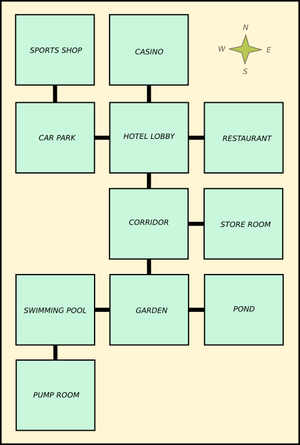
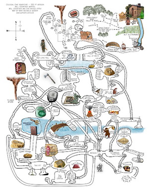
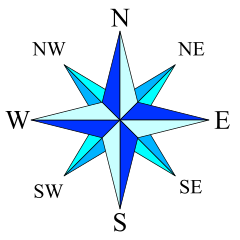

# Map-Based Game Ideas and Suggestions

## Game Theme

Any physical space / location / building / world can be represented by a map. So you are **completely free to come up with a theme** for a game.

Some theme ideas:
- In a **building** (old mansion, factory, science lab, etc.)
- Around a **site** (school, hospital, military base, etc.)
- Through a **town / city** (buildings, roads, sewers, etc.)
- Through **countryside** (forest, mountains, caves, etc.)
- Over **oceans** (islands, ports, sailing routes, etc.)
- In **outer-space** (planets, teleporters, etc.)
- Within a **biological body** (organs, blood vessels, etc.)

## Game Purpose

Your game should have a clear purpose for the player. This should be linked to the theme, but there is endless variation possible.

Some purpose ideas:
- Discover the **exit** (i.e. through a complex map)
- Collect **items** (e.g. keys to unlock doors, parts to build something, etc.)
- Uncover **a story** (e.g. via notes / diary entries)
- Get to a final location within a given **time limit**
- Get to a final location **before player dies** (e.g. radiation, bleeding, etc.)

## Game Map

You will need to come up with a location map for your game. The map should consist of **several locations** that are **connected to other locations** in some way.

The map could be based on a **grid**:

Or it could be more **organic**:

### Map Locations

Each location should have a **unique identifier**, along with other data that define the location:
- Location **name**
- Location **description**
- **Objects** found there
- etc.

### Connections Between Locations

Each location should be connected to one or more other locations via exits / directions to form the map.

The number of possible connections depends upon the complexity of your map, but could include:

- Cardinal compass directions: **N, S, W, E**
- Ordinal compass directions: **NW, NE, SW, SE**
- Vertical directions: **Up, Down**

Creating connections between locations is the key to this project, and there are many ways this cam be done:
- Using a co-ordinate system
- Using location ids / indices
- Using links to other location objects
- etc.

## Game GUI

The GUI should show the **status** of the game
- Current location (e.g. the name)
- Location information (e.g. description, etc.)
- Time taken / moves / score / etc. as required

*Note: There is no requirement to display the map graphically*

The user should be able to **interact** with the GUI to **move** and/or **perform actions**. These interactions can be in the form of:
- Mouse clicks (e.g. on buttons)
- Key presses (e.g. arrow keys)
- Typed text (e.g. to enter name, to guess a clue, etc.)

