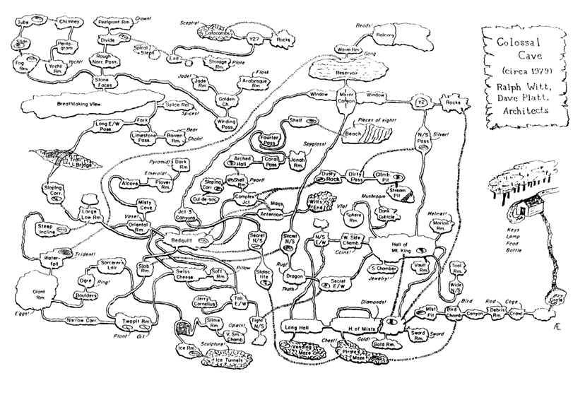

# NCEA Level 2 Programming Project Instructions

| Standard | Version | Level | Credits |
|----------|---------|-------|---------|
| 91906    | 2       | 3     | 6       |

## Contents

- [Introduction](#introduction)
- [Assessment Conditions](#assessment-conditions)
- [Detailed Game Specification](#detailed-game-specification)
- [Achievement Criteria](#achievement-criteria)
- [What You Need to Hand In](#what-you-need-to-hand-in)

---

## Introduction

You are to create a simple, interactive computer game with a graphical user interface (GUI), where the player can move between locations in a map, exploring with a particular purpose in mind: discovering the exit, finding lost items, etc.  

You will be assessed on how skilfully and effectively you construct, test, debug and document the program.

*Note: To help you come up with a game idea, [this document](ideas.md) has some suggestions for what the purpose of the game could be, and what the game map might look like.*

## Assessment Conditions

This is an 'open book' task. You may look at previous programs that you have written, and you may use the notes provided (e.g. the language reference documents). You may not however, simply modify a previous project - all code must be original.

### Plagiarism and the Use of AI

This is an individual assessment activity: All the work that you produce must be your own. Do not copy blocks of code from other people, nor use an AI code-generation tool to write blocks of code.

You will be asked to explain the workings of any/all of your code to assess whether you wrote and understand the code.

## Detailed Game Specification

The game that you program should:

1. Be for **one player** only

2. Involve movement within a world that is **defined by a logical map**. The map does not have to be visible to the user, but player movements should be defined by map locations and connections. 

3. Have a **clear purpose** for the player to aim for / achieve.

4. Be **non-trivial to play**, i.e. there should be an element of difficulty / challenge for the player

5. Provide clear and simple **instructions** on how to play the game (either at the start, or as play progresses)

6. Provide a **graphical user interface (GUI)** that is **well-designed and easy-to-use**. The interface should:
   - Be **intuitive** to use for the player
   - Show the **status** of the game as it progresses (e.g. player location, inventory, etc.)
   - **Prompt** players for input as needed 
   - Respond to **player actions** (e.g. mouse clicks, key presses)
   - Provide **feedback** on the result of player actions / moves 
   - Give an **overall summary** at the end-of-play (e.g. success / failure, score, time, etc.)

## Achievement Criteria

| Level          | Criteria                                                                        |
|----------------|---------------------------------------------------------------------------------|
| **Achieve**    | Use complex programming techniques to develop a computer program.               |
| **Merit**      | Use complex programming techniques to develop an **informed** computer program. |
| **Excellence** | Use complex programming techniques to develop an **refined** computer program.  |

*To help you keep track of how successfully you are meeting the criteria, use the [Checklist document](checklist.md)*

### Achieve Criteria

Use advanced programming techniques to develop a computer program means:

1. You need to write code for a program that:
   - Uses **variables** - at least two types (e.g. numeric, text, boolean)
   - Uses **sequence** - a series of instructions
   - Uses **selection** (branches) - making decisions (e.g. if...then, when, etc.)
   - Uses **iteration** (loops) - repeating things
   - Takes **input** from the user 
   - Produces **output** for the user to read

2. You need to use at least two 'complex' techniques, for example:
   - Programming a **graphical user interface (GUI)**
   - Reading from, or writing to, **files** or other storage
   - **Object-oriented programming (OOP)** using user-defined class(es) and objects
   - Using **user-defined types**
   - Using additional **non-core libraries** 
   - Using **complex data structures** (e.g. stacks, queues, trees)

3. You need to set out your **program code clearly** and document the program with **comments** 

4. You need to **test** and **debug** your program to ensure that it works with **expected** (valid) data values (this needs to be documented)

*Note: You must satisfy **all** of the criteria above to pass*

### Merit Criteria

Use complex programming techniques to develop an informed computer program means **all the criteria for Achieved**, plus:

1. Your program must be well-documented with:
   - appropriate and well-considered **variable / function names**
   - comments that **describe code function and behaviour**

2. Your code should follow **common conventions** for the Kotlin language (e.g. indentation, use of upper/lowercase, comment blocks, etc.)

3. You must test and debug your program **effectively** to ensure that as well as valid data, it also works with relevant **boundary** (edge/limit) data values (this needs to be documented)

### Excellence Criteria

Use complex programming techniques to develop a refined computer program means **all of the criteria for Merit**, plus:

1. Your program should be **well-structured** and a **logical** response to the task

2. You must make your program **flexible**, including:
   - Using **constants** and **derived values** in place of literal values
   - Using conditions, branching, loops and functions **effectively**

3. You must make your program **robust**, correctly handling **invalid** (unexpected) data values

4. You need to **comprehensively test** and **debug** your program to ensure that as well as valid / boundary data, it also copes wit **invalid** data (this needs to be documented)

## What You Need to Hand In

At the end of this project you will need to submit the following:

1. **Program Source Code** - a copy of your [program source](../src) file(s)

2. **Runnable Program** - an executable file (e.g. a JAR)

3. **Evidence of Testing** - [planning](test-plan.md) and [evidence](test-results.md) template have been provided for you to use for this

