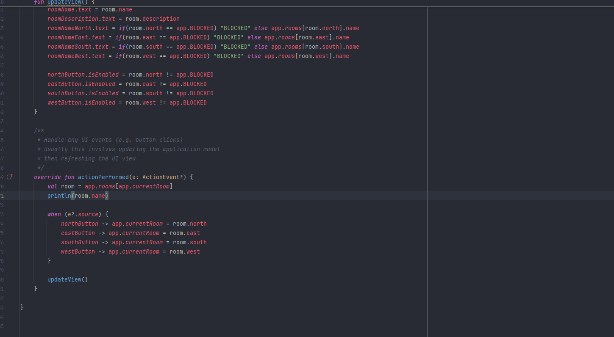
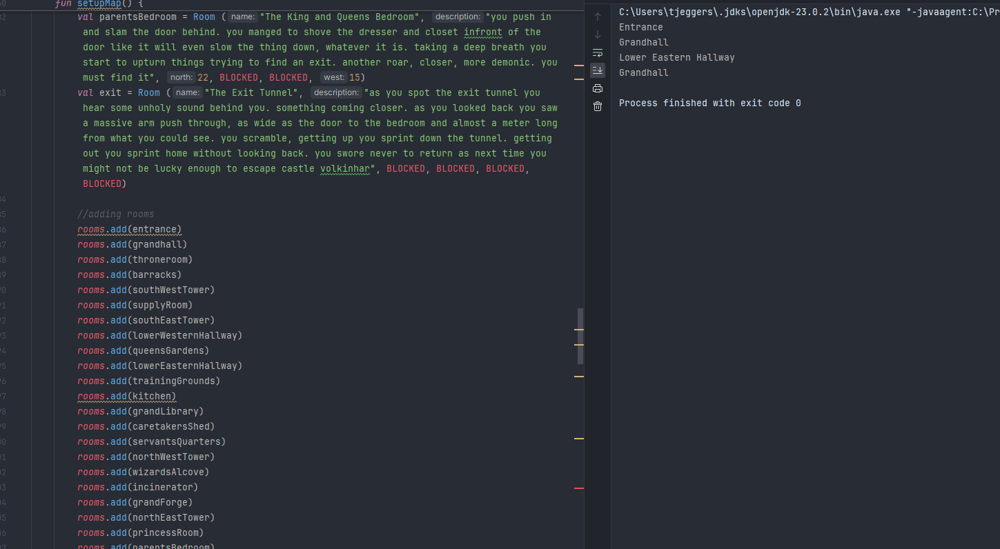
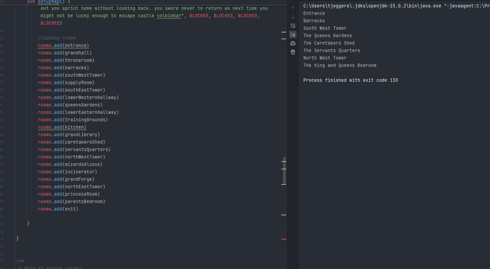

# Results of Testing

The test results show the actual outcome of the testing, following the [Test Plan](test-plan.md)

---

## Movement test

using the buttons I put in game to move around

### Test Result

it worked well and as intended

---

## movement being blocked

i will test that the movement buttons will be disabled if the player cannot move in the desired direction

### Test Data Used

a screen recorded gif showing off the code and the success

### Test Result

Comment on test result. Comment on test result. Comment on test result. Comment on test result. Comment on test result. Comment on test result.

---

---

### ending tunnel end state blocking all movement 

i will test that the final room in the game blocks off all movement 

### Test Data Used 

a screen recorded gif showing off code and success

### Test Results

the end of the game will block off all movement with an ending message

---

## all rooms work

i have checked that all rooms work

### Test Data Used

a screen recording of the code ands game

### Test Results

all rooms work as intended

